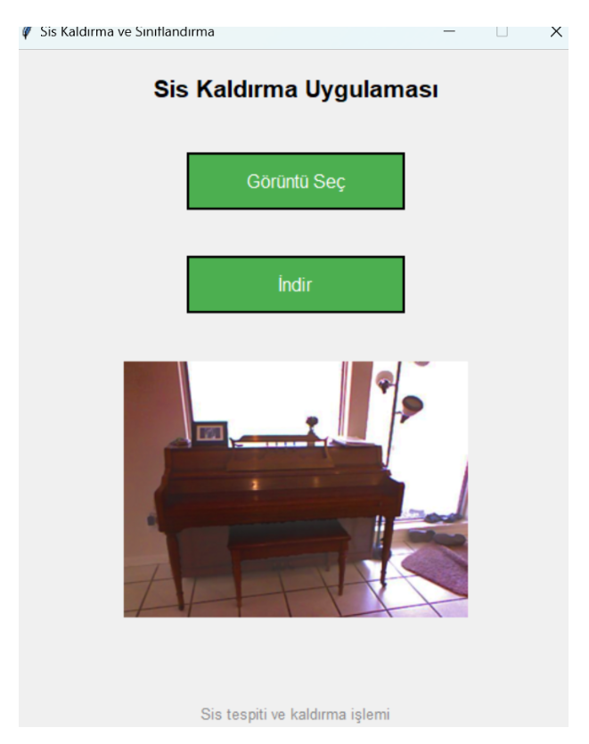

# Haze-Detection-and-Removal-with-CNN-and-DCP
This project utilizes a Convolutional Neural Network (CNN) to classify images as hazy or clear. If the image is hazy, the Dark Channel Prior (DCP) algorithm is applied to remove the haze and enhance the image clarity.

## Project Overview

The main goal of this project is to provide an efficient method for detecting haze in images and then removing it using a deep learning model (CNN) and a classical image processing technique (DCP). The CNN is trained to classify whether an image contains haze or not, and if haze is detected, the DCP algorithm is applied to remove the haze and enhance the image.

## Requirements

- Python
- torch
- Pillow
- scikit-image
- numpy
- scipy
- matplotlib

You can install the necessary dependencies by running the following command:

```bash
pip install -r requirements.txt
```


## Installation

Clone the repository to your local machine:

```bash
git clone https://github.com/ilknurpehlivan/Haze-Detection-and-Removal-with-CNN-and-DCP.git
```


## How It Works

Haze Detection:
A CNN is trained to classify whether an image contains haze or not.
The model is trained on a labeled dataset of hazy and non-hazy images.

Haze Removal:
If haze is detected in an image, the DCP algorithm is applied to estimate the transmission map and atmospheric light, and then haze is removed to restore image clarity.

## Dataset
The datasets used for training the CNN model and for testing the haze removal process are publicly available.

1. Dense Haze Dataset - NTIRE 2019 Challenge Dataset
The Dense Haze Dataset is part of the NTIRE 2019 Challenge and provides a large set of hazy and haze-free image pairs for training and testing. It contains both real-world and synthetic images with dense haze in various scenes.

Dataset Source: https://data.vision.ee.ethz.ch/cvl/ntire19//dense-haze/

2. RESIDE Standard Dataset
The RESIDE Standard Dataset contains both real and synthetic hazy images along with ground truth for haze removal tasks. It is designed to evaluate dehazing methods.

Dataset Source: https://sites.google.com/view/reside-dehaze-datasets/reside-standard

### How to Use the Dataset
Download the Datasets using the links above, then extract and organize the images into separate folders for hazy images and corresponding clear (haze-free) images.
Place the datasets into the "data" folder of this repository.

## Training the Model

To train the CNN model, you need to prepare the dataset and run the following script:

```bash
python train.py
```

## Here is how the interface looks:



